---
title: RIOT Hands-on Tutorial
author: Martine Lenders
...

# Starting the RIOT
## Preparations
\tiny

For links go to [https://github.com/RIOT-OS/Tutorials](https://github.com/RIOT-OS/Tutorials)

**Quick Setup** (Using a Virtual Machine)

* Install and set up [git](https://help.github.com/articles/set-up-git/)
* Install [VirtualBox](https://www.virtualbox.org/wiki/Downloads) & [VirtualBox Extension Pack](https://www.virtualbox.org/wiki/Downloads)
* Install [Vagrant](https://www.vagrantup.com/downloads.html)
* `git clone --recursive https://github.com/RIOT-OS/Tutorials`
* Go to RIOT root directory: `cd Tutorials/RIOT`
* Run the [Vagrant RIOT Setup](https://github.com/RIOT-OS/RIOT/blob/master/dist/tools/vagrant/README.md)
* Make sure you've run `vagrant ssh` and clone the Tutorials folder again, now in your virtual machine: `git clone --recursive https://github.com/RIOT-OS/Tutorials`

**Recommended Setup** (Without Using a VM)

* Install and set up [git](https://help.github.com/articles/set-up-git/)
* Install the build-essential packet (make, gcc etc.). This varies based on the operating system in use.
* Install [Native dependencies](https://github.com/RIOT-OS/RIOT/wiki/Family:-native#dependencies)
* Install [OpenOCD](https://github.com/RIOT-OS/RIOT/wiki/OpenOCD)
* Install [GCC Arm Embedded Toolchain](https://launchpad.net/gcc-arm-embedded)
* On OS X: install [Tuntap for OS X](http://tuntaposx.sourceforge.net/)
* [additional tweaks](https://github.com/RIOT-OS/RIOT/wiki/Board:-Samr21-xpro) necessary to work with the targeted hardware (ATSAMR21)
* Install `netcat` with IPv6 support (if necessary)\
  `sudo apt-get install netcat-openbsd`
* `git clone --recursive https://github.com/RIOT-OS/Tutorials`
* Go to the Tutorials directory: `cd Tutorials`

## Running RIOT
* Applications in RIOT consist at minimum of
    - a `Makefile`
    - a C-file, containing a `main()` function
* To see the code go to the task-01 directory:

```sh
cd task-01
ls
```

## Your first application -- The Makefile
\scriptsize

```Makefile
# name of your application
APPLICATION = Task01

# If no BOARD is found in the environment, use this default:
BOARD ?= native

# This has to be the absolute path to the RIOT base directory:
RIOTBASE ?= $(CURDIR)/../../RIOT

# Comment this out to disable code in RIOT that does safety checking
# which is not needed in a production environment but helps in the
# development process:
CFLAGS += -DDEVELHELP

# Change this to 0 show compiler invocation lines by default:
QUIET ?= 1

# Modules to include:
USEMODULE += shell
USEMODULE += shell_commands
USEMODULE += ps

include $(RIOTBASE)/Makefile.include
```

## Your first application -- The C-file
```C
#include <stdio.h>
#include <string.h>

#include "shell.h"

int main(void)
{
    puts("This is Task-01");

    char line_buf[SHELL_DEFAULT_BUFSIZE];
    shell_run(NULL, line_buf, SHELL_DEFAULT_BUFSIZE);

    return 0;
}
```

## Task 1.1: Run your first application as Linux process
1. Compile & run on `native`: `make all term`
2. Type `help`
3. Type `ps`
4. Modify your application:
    - Add a `printf("This application runs on %s", RIOT_BOARD);` *before* `shell_run()`
    - Recompile and restart `make all term`
    - Look at the result

## Task 1.2: Run your first application on real hardware
1. Compile, flash and run on `samr21-xpro` \
    `BOARD=samr21-xpro make all flash term` \
    (or other `BOARD` if available)
2. Verify output of `RIOT_BOARD`

# Custom shell commands
## Writing a shell handler
* Shell command handlers in RIOT are functions with signature

```C
int cmd_handler(int argc, char **argv);
```

* `argv`: array of strings of arguments to the command

```
print hello world    # argv == {"print", "hello", "world"}
```

* `argc`: length of `argv`

## Adding a shell handler to the shell
* Shell commands need to be added manually to the shell on initialization

```C
#include "shell.h"

static const shell_command_t shell_commands[] = {
    { "command name", "command description", cmd_handler },
    { NULL, NULL, NULL }
};

/* ... */
    shell_run(commands, line_buf, SHELL_DEFAULT_BUFSIZE)
/* ... */
```

## Task 2.1 -- A simple echo command handler
* Go to task-02 directory (`cd ../task-02`)
* Write a simple echo command handler in main.c:
    - First argument to the echo command handler shall be printed to output

```
> echo "Hello World"
Hello World
> echo foobar
foobar
```

## Task 2.2 -- Control the hardware
* `board.h` defines a macro `LED0_TOGGLE` to toggle the primary LED on the board.
* Write a command handler `toggle` in main.c that toggles the primary LED on the board

# Multithreading
## Threads in RIOT
* Threads in RIOT are functions with signature

```C
void *thread_handler(void *arg);
```

* Use `thread_create()` from `thread.h` to start:

```C
pid = thread_create(stack, sizeof(stack),
                    THREAD_PRIORITY_MAIN - 1,
                    THREAD_CREATE_STACKTEST,
                    thread_handler,
                    NULL, "thread");
```

## RIOT kernel primer
**Scheduler:**

- Tick-less scheduling policy ($O(1)$):
    * Highest priority thread runs until finished or blocked
    * ISR can preempt any thread at all time
    * If all threads are blocked or finished:
        - Special IDLE thread is run
        - Goes into low-power mode

**IPC** (not important for the following task):

- Synchronous (default) and asynchronous (optional, by IPC queue initialization)

## Task 3.1 -- Start a thread
* Go to task-03 directory (`cd ../task-03`)
* Open `main.c`
* Reminder:

```C
pid = thread_create(stack, sizeof(stack),
                    THREAD_PRIORITY_MAIN - 1,
                    THREAD_CREATE_STACKTEST,
                    thread_handler,
                    NULL, "thread");
```

* Start the thread `"thread"` from within `main()`
* Run the application on `native`: `make all term`
* Check your output, it should read: `I'm in "thread" now`

# Timers
## `xtimer` primer
* `xtimer` is the high level API of RIOT to multiplex hardware timers
* Examples for functionality:
    - `xtimer_now()` to get current system time in microseconds
    - `xtimer_sleep(sec)` to sleep `sec` seconds
    - `xtimer_usleep(usec)` to sleep `usec` microseconds

## Task 4.1 -- Use `xtimer`
* Reminder: Functions `xtimer_now()`, `xtimer_sleep()`, and `xtimer_usleep()` were introduced
* Go to task-04 directory (`cd ../task-04`)
* Note the inclusion of `xtimer` in Makefile

```Makefile
USEMODULE += xtimer
```

* Create a thread in `main.c` that prints the current system time every 2 seconds
* Check the existence of the thread with `ps` shell command


# General networking architecture
## RIOT's Networking architecture
* Designed to integrate any network stack into RIOT

\only{<1>}{\includegraphics[width=\textwidth]{pictures/overview-net.pdf}}
\only{<2>}{\includegraphics[width=\textwidth]{pictures/overview-net-netdev.pdf}}

## Including the network device driver
* Go to task-05 directory (`cd ../task-05`)
* Note inclusion of `netdev` modules in Makefile

```Makefile
USEMODULE += gnrc_netdev_default
USEMODULE += auto_init_gnrc_netif
```

## Virtual network interface on `native`
* Use `tapsetup` script in RIOT repository:

```sh
./../RIOT/dist/tools/tapsetup/tapsetup -c 2
```

* Creates
    - Two TAP interfaces `tap0` and `tap1` and
    - A bridge between them (`tapbr0` on Linux, `bridge0` on OSX)
* Check with `ifconfig` or `ip link`!

## Task 5.1 -- Your first networking application
* Run the application on `native`: `PORT=tap0 make all term`
* Type `help`
* Run a second instance with `PORT=tap1 make all term`
* Type `ifconfig` on both to get hardware address and interface number
* Use `txtsnd` command to exchange messages between the two instances

## Task 5.2 -- Use your application on real hardware
* Compile, flash, and run on the board `BOARD=samr21-xpro make all flash term`
* Type `ifconfig` to get your hardware addresses
* Use `txtsnd` to send one of your neighbors a friendly message

## RIOT's Networking architecture
\only{<1>}{\includegraphics[width=\textwidth]{pictures/overview-net.pdf}}
\only{<2>}{\includegraphics[width=\textwidth]{pictures/overview-net-conn.pdf}}

## conn
* collection of unified connectivity APIs to the transport layer
* What's the problem with POSIX sockets?
    - too generic for most use-cases
    - numerical file descriptors (internal storage of state required)
    - in general: too complex for usage, too complex for porting
* protocol-specific APIs:
    - `conn_ip` (raw IP)
    - `conn_udp` (UDP)
    - `conn_tcp` (TCP)
    - ...
* both IPv4 and IPv6 supported

## Task 6.1 -- Use UDP for messaging
* Go to `task-06` directory `cd ../task-06`
* Note the addition of `gnrc_conn_udp` to Makefile
* `udp.c` utilizes `conn_udp_sendto()` and `conn_udp_recvfrom()` to exchange UDP packets
* Compile and run on two `native` instances
* Type `help`
* Use `udps 8888` to start a UDP server on port 8888 on first instance (check with `ps`)
* Use `ifconfig` to get link-local IPv6 address of first instance
* Send UDP packet from second instance using `udp` command to first instance


## Task 6.2 -- Communicate with Linux
* Compile and run a `native` instance
* Start a UDP server on port 8888 (using `udps`)
* Send a packet to RIOT from Linux using `netcat`

```sh
echo "hello" | nc -6u <RIOT-IPv6-addr>%tap0 8888
```

* Start a UDP server on Linux `nc -6lu 8888`
* Send a UDP packet from RIOT to Linux\
  `udp <tap0-IPv6-addr> 8888 hello`

## Task 6.3 -- Exchange UDP packets with your neighbors
* Compile, flash and run on the board `BOARD=samr21-xpro make all flash term`
* Send and receive UDP messages to and from your neighbors using `udp` and `udps`

# GNRC
## The components of GNRC
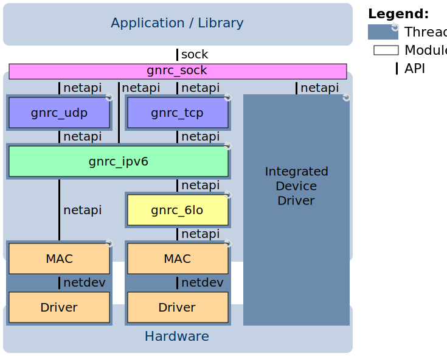

## `netapi`
* Inter-modular API utilizing IPC
* Two asynchronous message types (don't expect reply) for data transfer:
    - `GNRC_NETAPI_MSG_TYPE_SND`: pass "down" the stack (send)
    - `GNRC_NETAPI_MSG_TYPE_RCV`: pass "up" the stack (receive)
* Two synchronous message types (expect reply) for option handling:
    - `GNRC_NETAPI_MSG_TYPE_GET`: get option value
    - `GNRC_NETAPI_MSG_TYPE_SET`: set option value
* Specification deliberately vague\
  $\Rightarrow$ implementations can make own preconditions on data


## Network interfaces in GNRC (1)
\begin{figure}
\centering
\only<1|handout:0>{\includegraphics{pictures/gnrc-arch.pdf}}%
\only<2->{\includegraphics{pictures/gnrc-arch-netif.pdf}}%
\end{figure}

## Network interfaces in GNRC (2)
* `netapi`-capable thread as any other protocol implementation
* Implement MAC protocol
* Communication to driver via `netdev`\
  $\Leftarrow$ timing requirements for e.g. TDMA-based MAC protocols

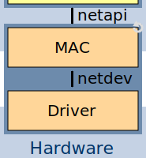

## `netreg`
* How to know where to send `netapi` messages? \pause
* Both protocol implementation and users can register to be interested in type + certain context (e.g. port in UDP)

```C
gnrc_netreg_entry_t ipv6_handler = { NULL,
                               GNRC_NETREG_DEMUX_CTX_ALL,
                               ipv6_handler_pid};
gnrc_netreg_register(GNRC_NETTYPE_IPV6, &ipv6_handler);

gnrc_netreg_entry_t dns_handler = { NULL, PORT_DNS,
                              dns_handler_pid};
gnrc_netreg_register(GNRC_NETTYPE_UDP, &dns_handler);
```

$\Rightarrow$ Find handler for packets in registry

## `pktbuf`
* Data packet stored in `pktbuf`
* Representation: list of variable-length "packet snips"
* Protocols can *mark* sections of data to create new snip
* Keeping track of referencing threads: reference counter `users`
    - If `users == 0`: packet removed from packet buffer
    - If `users > 1` and write access requested: packet duplicated (*copy-on-write*)

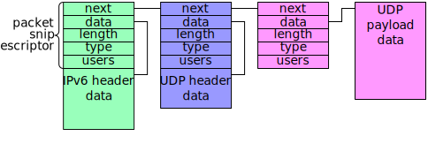

## `pktbuf` -- keeping duplication minimal
* Only copy up to most *current* packet snip \
  $\Rightarrow$ Packets become tree-like \
  $\Rightarrow$ Reverse order for received packets to only have one pointer

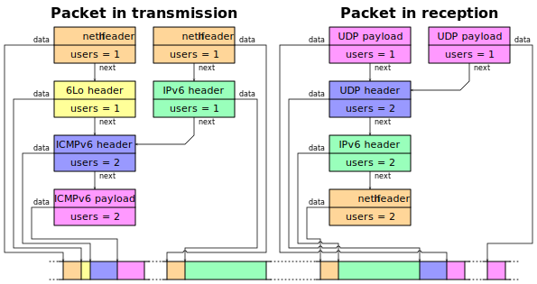

## RIOT examples
The remaining slides utilize the RIOT examples:

```sh
cd ../RIOT/examples/
ls
```

## `gnrc_minimal` example (`native`)
* `*` = name might be subject to change

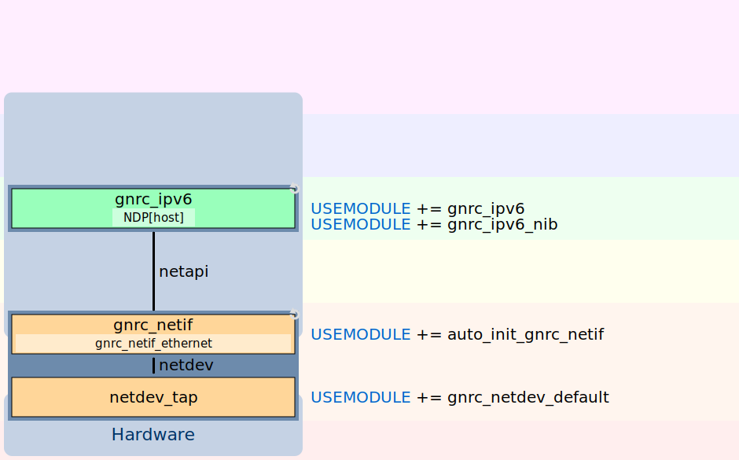

## `gnrc_minimal` example (`samr21-xpro`)
* `*` name might be subject to change

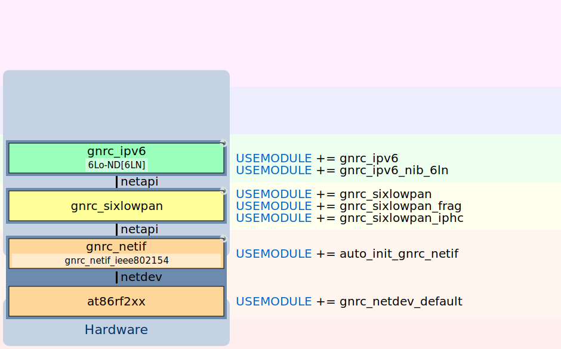

## Some short-cuts (`Makefile.dep`)
Pseudo-module dependencies

* `gnrc_sixlowpan_default`:
    - `gnrc_sixlowpan`
    - `gnrc_sixlowpan_frag`
    - `gnrc_sixlowpan_iphc`
* `gnrc_ipv6_default`:
    - `gnrc_ipv6`
    - `gnrc_ndp_host` (if non-6Lo interface present)
    - `gnrc_sixlowpan_default` (if 6Lo interface present)
    - `gnrc_sixlowpan_nd` (if 6Lo interface present)

## `gnrc_minimal` example (`native`)
* `*` = name might be subject to change

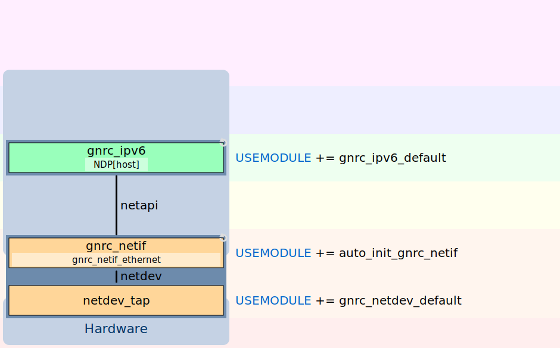

## `gnrc_minimal` example (`samr21-xpro`)
* `*` = name might be subject to change

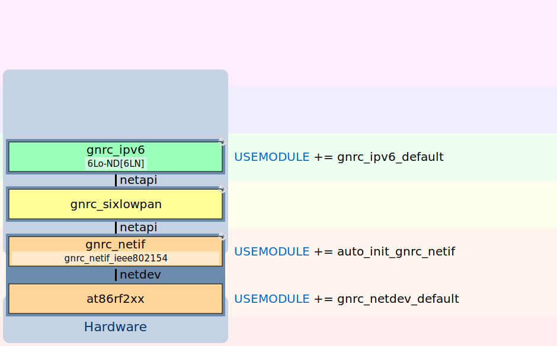

## Task 7.1 -- Compile the `gnrc_minimial` application
* Go to the `gnrc_minimal` application (`cd gnrc_minimal`)
* Compile and run on `native`
* Should print something like `My address is fe80::d403:24ff:fe89:2460`
* Ping RIOT instance from Linux:

```sh
ping6 <RIOT-IPv6-addr>%tap0
```

## `gnrc_minimal` example (`samr21-xpro`)
* Adding a simple application
* `*` = name might be subject to change

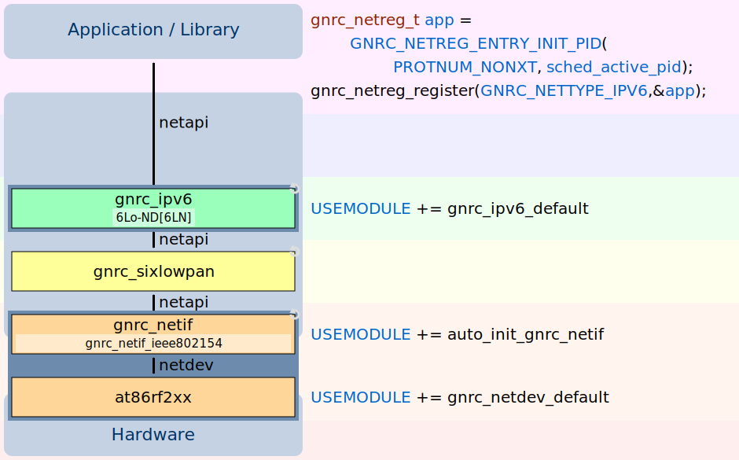

## Task 7.2 -- Extend `gnrc_minimal` application
* Add the `gnrc_udp` module to the application
* Register for UDP packets of port 8888

```C
/* include "sched.h" and "net/gnrc/netreg.h"! */
unsigned int count = 0; msg_t msg;
gnrc_netreg_t server = {NULL, 8888, sched_active_pid};
gnrc_netreg_register(GNRC_NETTYPE_UDP, &app);

while (1) {
    msg_receive(&msg);
    printf("Received %u UDP packets\n", ++count);
}
```

* Compile and run on `native`
* Send UDP packet to RIOT node using `netcat`

```sh
echo "hello" | nc -6u <RIOT-IPv6-addr>%tap0 8888
```

## `gnrc_networking` example (`native`)
* `*` = name might be subject to change

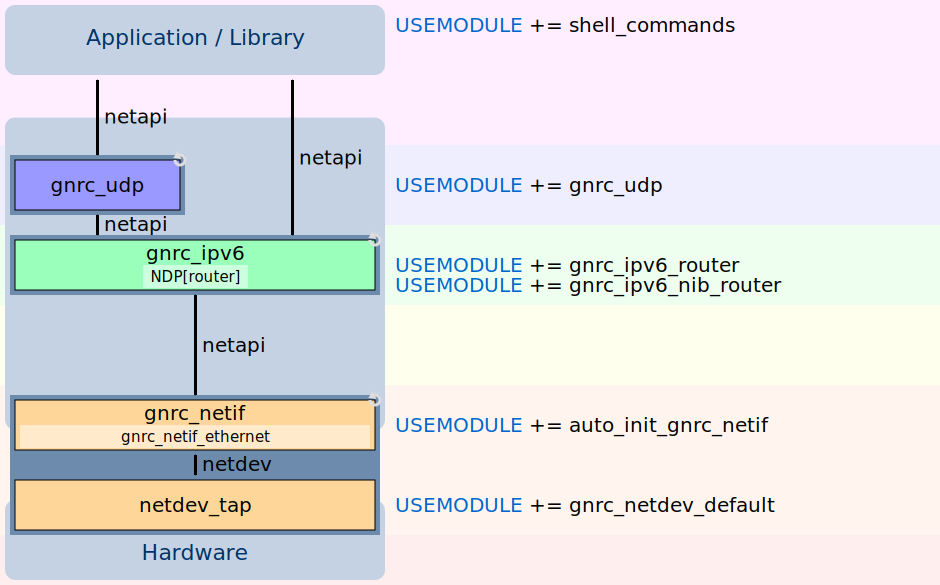

## `gnrc_networking` example (`samr21-xpro`)
* `*` = name might be subject to change

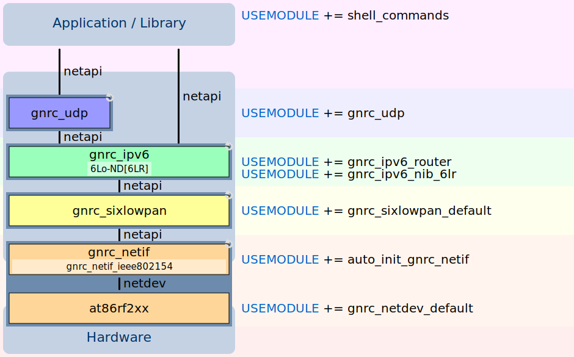

## More short-cuts (`Makefile.dep`)
Pseudo-module dependencies

* `gnrc_ipv6_router_default`:
    - `gnrc_ipv6`
    - `gnrc_ndp_router` (if non-6Lo interface present)
    - `gnrc_sixlowpan_default` (if 6Lo interface present)
    - `gnrc_sixlowpan_nd_router` (if 6Lo interface present)

## `gnrc_networking` example (`native`)
* `*` = name might be subject to change

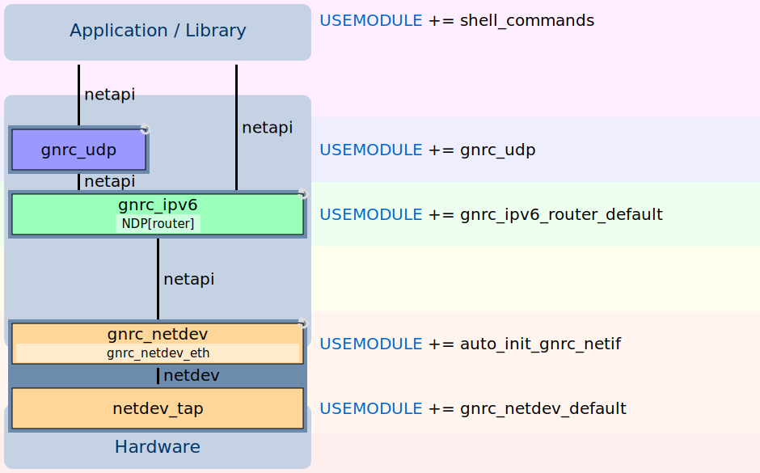

## `gnrc_networking` example (`samr21-xpro`)
* `*` = name might be subject to change

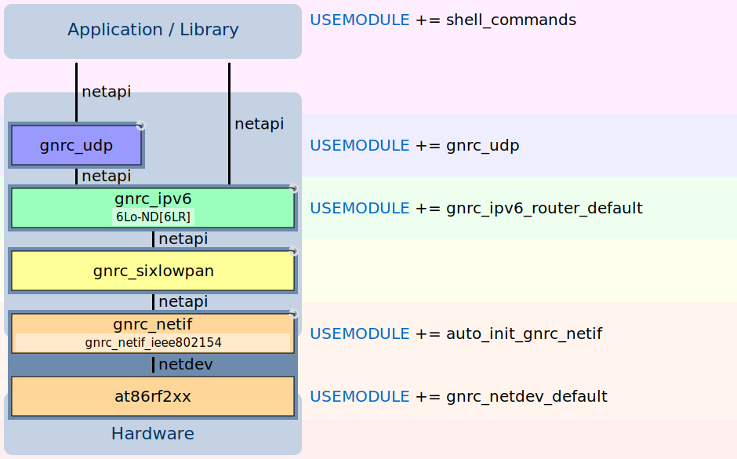

## Task 7.3 -- Send your neighbor some messages again
* Go to `gnrc_networking` example: `cd ../gnrc_networking`
* Have a look in `udp.c` how packets are constructed and send
* Compile, flash, and run on the board `BOARD=samr21-xpro make all flash term`
* Type `help`
* Start UDP server on port 8888 using `udp server 8888`
* Get your IPv6 address using `ifconfig`
* Send your neighbor some messages using `udp send`

## `gnrc_tftp` example
* for simplicity only the `samr21-xpro` examples from now on
* `*` = name might be subject to change


## Make your application stack independent
* `*` = name might be subject to change

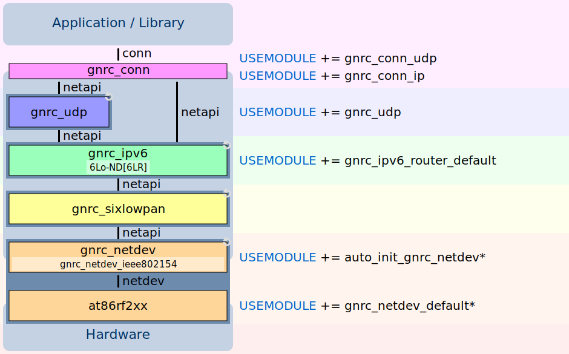

## `microcoap` example
* `*` = name might be subject to change


## `posix_sockets` example
* `*` = name might be subject to change

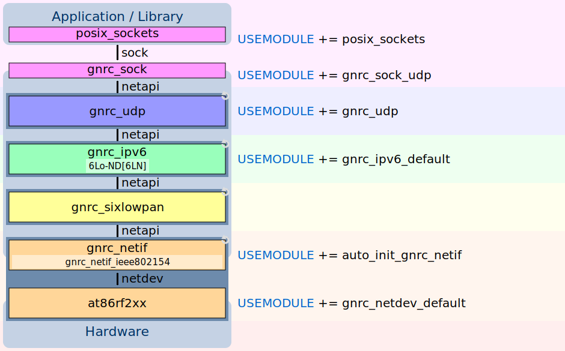

## lwIP instead of GNRC
* `*` = name might differ on other devices

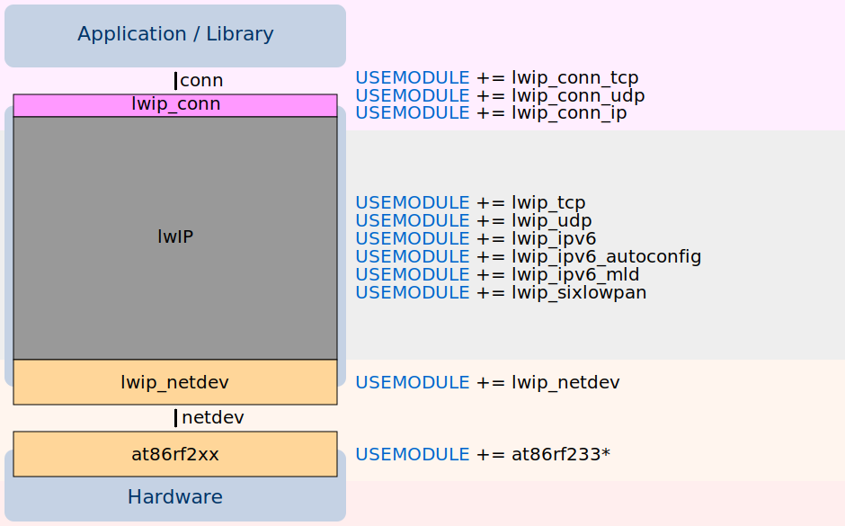

## emb6 (uIP-fork) instead of GNRC
* `*` = name might differ on other devices

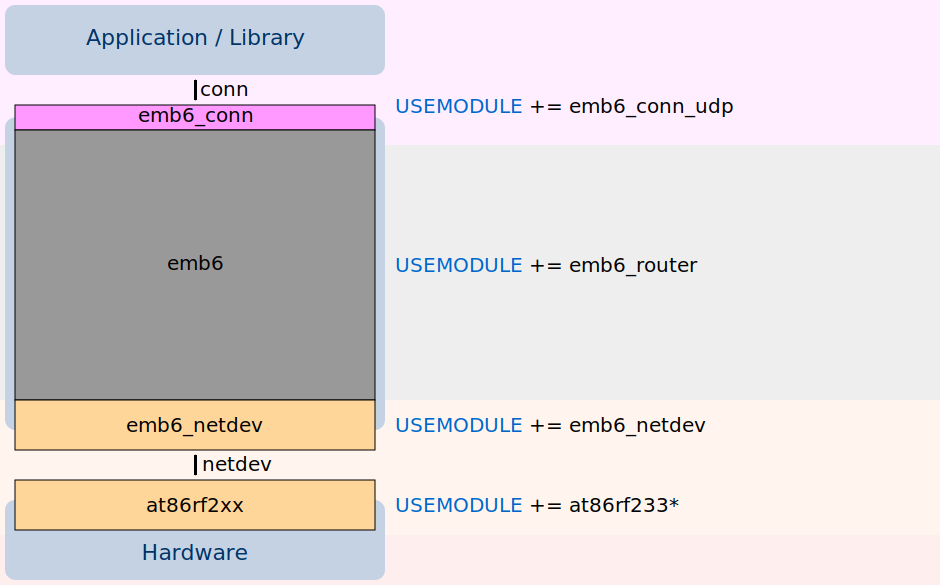

## `ccn_lite_relay` example
* `*` = name might be subject to change

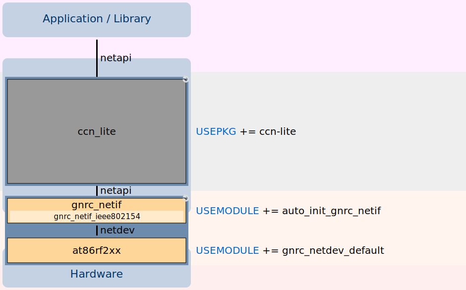

## CCN-lite over UDP example
* `*` = name might be subject to change

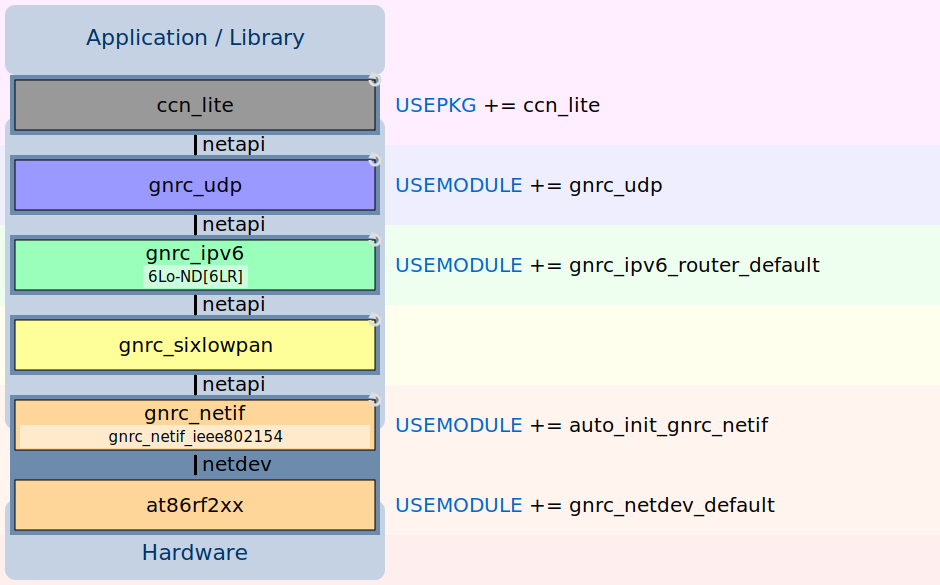

## CCN-lite over IPv6 example
* `*` = name might be subject to change

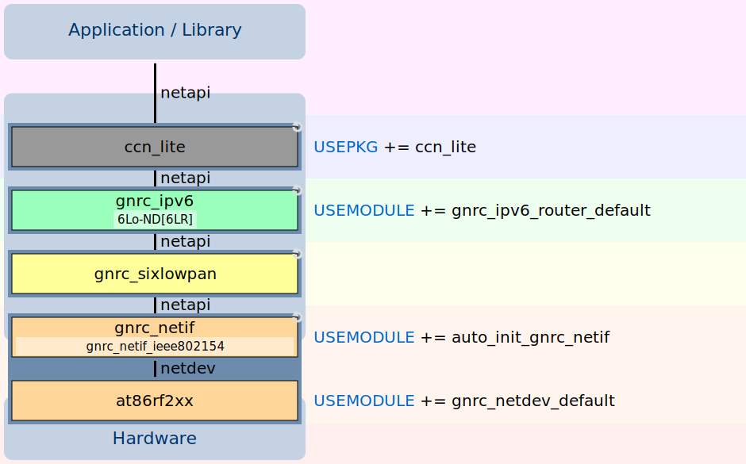

## Example: multiple radios of the same type
* `*` = name might be subject to change

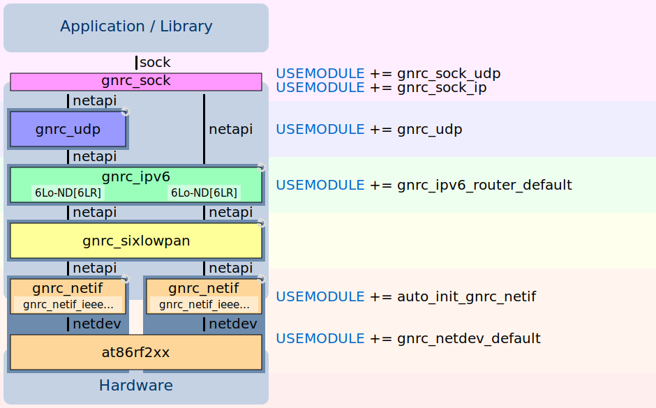

## `gnrc_border_router` example
* `*` = name might be subject to change

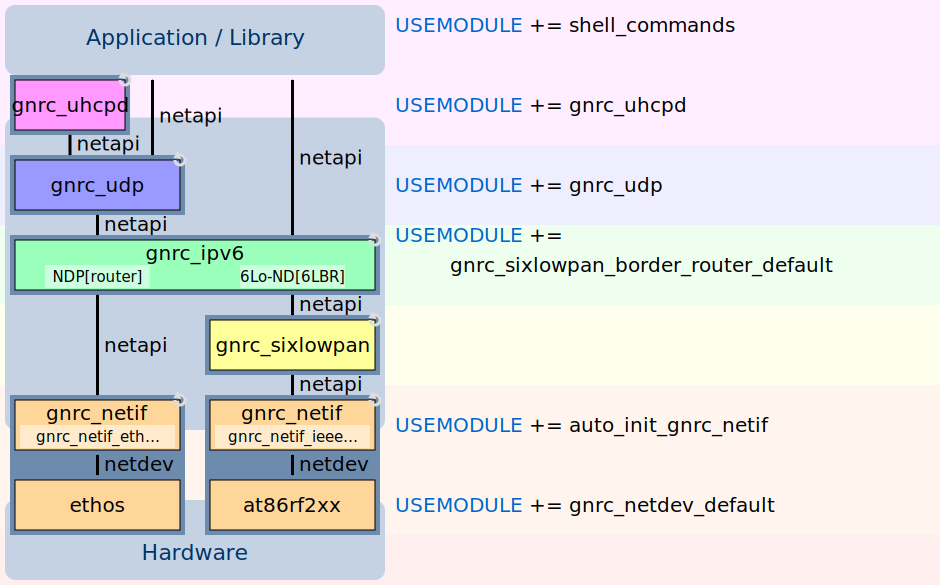

# Now go out and make something!
* Final slide
